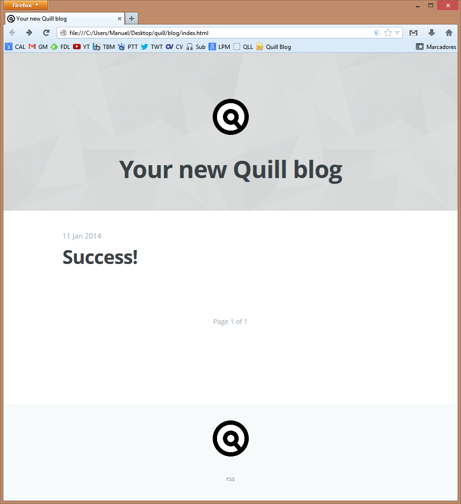

title: Success!
author: Quill
date: 2014/01/11 00:00
tags: quill
      installation

If you can see this post, you have run Quill successfully. Congratulations! Let's see an image of your new blog:

# First things first

The Markdown document used to generate this post is in `posts` subfolder (in quill directory). You can delete this entry simply removing `welcome.md` document.

To configure your new blog, you'll need to edit `quill.cfg` file with any text editor. The file will be something like this:

    [Basic]
    BlogName		= Your new Blog name
    BlogDescription = Here you can insert a brief description of your blog
    BlogURL			= Blog base URL, used to references. Use something like http://www.whatever.com/blog
    Theme			= ghost-dropbox
    
    [Folders]
    PostsFolder		= ./posts
    DraftsFolder	= ./drafts
    ThemesFolder	= ./themes
    BlogFolder		= ./blog
    ImgsFolder		= ./posts/images
    
    [BlogContent]
    AboutMe			= Yes
    PostsPerPage	= 10
    CompleteFeed	= No
    Comments		= No
    
    [Misc]
    TagName			= Tags
    TagHeader		= Posts with tag
    AboutHeader		= About me
    Footer			= Proudly published with Quill
    NewerPosts		= Newer posts
    OlderPosts		= Older posts
    Page			= Page
    Of				= of

+ In `[Basic]` section, you can configure the name and the description of your blog, the URL and the theme.

+ In `[Folders]` section, you can modify the folders where quill will look for the entries, the drafts, the themes and the local images (in case you prefer to store images locally instead of use an image hosting service). Quill will generate the blog in `BlogFolder` directory.

+ In `[BlogContent]` section, you can specify if the blog will have an About Me section (if so, you should create an `about.md` document in your `posts` folder with some information about you. You can also specify the number of entries you want to see in blog main page.

	If you want comments in your blog, you should enable them setting `Comments` to `Yes`. `CompleteFeed` means that your RSS feed will contain the complete post, but in current release is better not to enable it.
+ In `[Misc]` section, you can translate some strings to adapt the blog to your own language.

# Writing new posts

You can write new posts using **Markdown**. Markdown is a plain text formatting syntax designed to be easy-to-read and easy-to write. You can check Markdown syntax in [Markdown page](http://daringfireball.net/projects/markdown/syntax).

Quill requires some metadata to organize posts in the blog:

    title: My new post title
    author: John Doe
    date: YYYY/MM/DD HH:MM
    tags: tag1
          tag2

Tags are optional, but title, author and date are necessary.

When you have finished your new post, save the document with `.md` extension and execute Quill to generate the blog. You can save `welcome.md` file to use later as an example.