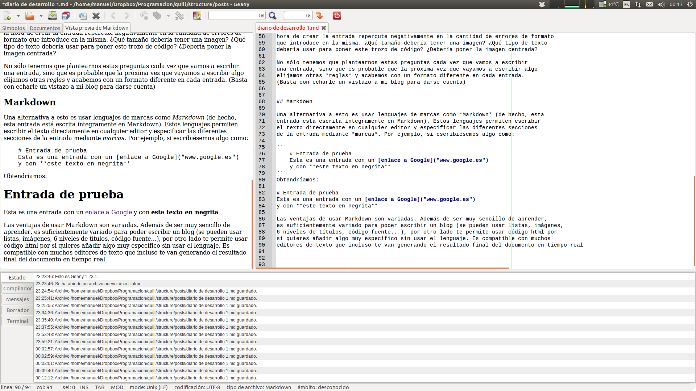

title:   ¿Es necesario OTRO servicio de blogs hoy en día?
author:  Manuel Pedrero
date:    2013-11-25
tags:    quill
         development

¿Tiene sentido ponerse a crear un *engine* para blogs hoy día? Existiendo
gigantes como Wordpress, Blogger o Tumblr la respuesta obvia es no. De
hecho, aunque estas soluciones a menudo *maten moscas a cañonazos* no se
puede negar que hoy día crear un blog es tan sencillo como registrate en
uno de los tres sitios anteriores (o de cualquiera del resto de servicios
webs que seguramente existan), ponerle un nombre al blog, elegir un tema
y empezar a escribir cómodamente desde un editor web.

Sin embargo, la realidad en muchos casos es [ésta](http://ferminalcon.wordpress.com/).

Colores chillones y en ocasiones ilegibles, fuentes que hacen daño a la vista,
la estructura del blog rota por imágenes excesivamente grandes, etc. Y en este
caso parece ser un blog activo y cuyo administrador se ha *currado* sus secciones, 
encabezados personalizados para las categorías y ha debido mirar en Internet cómo
colocar al menos imágenes y vídeos de Youtube. El panorama es aún peor en otras
ocasiones.

En [mi blog actual](http://www.korsoblog.com/) intenté cuidar un poco el
diseño y conseguir una apariencia simple y medianamente agradable. Con el 
editor de Blogger quité todas las secciones que consideraba superfluas e
intenté personalizar uno de los temas para conseguir un aspecto simple y 
elegante. Aunque después de echar un rato conseguí dejarlo aceptablemente bien, 
seguía habiendo un problema: editar las entradas.

## Editores WYSIWYG

En general, me gustan los editores *what you see is what you get*, te permiten
ver en todo momento cómo se está quedando el documento, la web o lo que sea que
estés editando y permiten hacer cambios de estilo muy fácilmente y ver los resultados
inmediatamente. Su gran virtud, y a la vez su gran problema es que esa facilidad de
uso permite que cualquier persona pueda usarlos sin tener idea de lo que está haciendo.

Un ejemplo claro de esto es *Word*. Un usuario puede simplemente abrir *Word* y empezar
a escribir un documento. En el peor de los casos, cuando quiera introducir un título
o una sección cambiará manualmente el tamaño de la letra y quizás la ponga en negrita.
Alguien más avispado, seguramente haga uso de los *estilos* de párrafo para ahorrarse
tener que cambiar todas las secciones del documento a mano, y de paso poder generar
una tabla de contenido con un clic. Por último, un *usuario avanzado* seguramente cree
sus propios estilos, configure sus márgenes, haga uso de referencias cruzadas, genere la
bibliografía, índices de tablas y figuras, etc.

A la hora de insertar imágenes en el documento, habrá quien redimensione cada una de ellas
para que tengan la misma anchura y quede un formato más elegante. Otros no tendrán en cuenta
este aspecto, y otros abusarán de los marcos predefinidos y llenarán el documento de sombras,
transparencias y posiblemente tipografías poco aptas.

## Editores de blogs

La mayoría de servicios como Blogger utilizan un editor de texto web con un enfoque
similar al de *Word*. El problema es que (en mi opinión) la libertad que da a la
hora de crear la entrada repercute negativamente en la cantidad de errores de formato
que introduce en la misma. ¿Qué tamaño debería tener una imagen? ¿Qué tipo de texto
debería usar para poner este trozo de código? ¿Debería poner la imagen centrada?

No sólo tenemos que plantearnos estas preguntas cada vez que vamos a escribir
una entrada, sino que es probable que la próxima vez que vayamos a escribir algo 
elijamos otras *reglas* y acabemos con un formato diferente en cada entrada.
(Basta con echarle un vistazo a mi blog para darse cuenta)

## Markdown

Una alternativa a esto es usar lenguajes de marcas como *Markdown* (de hecho, esta
entrada está escrita íntegramente en Markdown). Estos lenguajes permiten escribir
el texto directamente en cualquier editor y especificar las diferentes secciones
de la entrada mediante *marcas*. Por ejemplo, si escribiésemos algo como:

    # Entrada de prueba
    Esta es una entrada con un [enlace a Google](www.google.es) 
    y con **este texto en negrita**

Obtendríamos:

> # Entrada de prueba
> Esta es una entrada con un [enlace a Google](http://www.google.es) 
> y con **este texto en negrita**

Las ventajas de usar Markdown son variadas. Además de ser muy sencillo de aprender,
es suficientemente variado para poder escribir un blog (se pueden usar listas, imágenes, 
6 niveles de títulos, código fuente...), por otro lado te permite usar código html por 
si quieres añadir algo muy específico sin usar el lenguaje. Es compatible con muchos
editores de texto que incluso te van generando el resultado final del documento en tiempo real:

Aunque puedes usar simplemente el bloc de notas de Windows para escribir una entrada.

## ¿Y para qué molestarse en aprender Markdown cuando puedo utilizar un editor convencional? 

A priori, se me ocurren tres ventajas:

1. No te tienes que preocupar más del estilo, ya que tú simplemente defines
   las secciones de la entrada (esto es un título, esto es una cabecera, esto
   es un trozo de código...) y el formato se lo dejas al engine, con lo que 
   tienes un tema consistente, uniforme en todas las entradas y sin que haga
   "cosas raras" por algún error tuyo.
   
2. Tienes siempre el documento original en tus manos. Ya no tienes que exportar
   el la entrada desde el sitio web en a saber qué formato (como sea html suerte
   para modificar algo o importarlo en otro blog con la cantidad de tags que tendrá).
   Gracias a esto, puedes tener un *backup* de tu blog en una carpeta y, como Markdown
   es perfectamente legible abriéndolo directamente en modo texto, puedes ver las entradas, 
   y modificar cualquier error que hayas podido tener.
   
3. Se aprende a usar **completamente** en una hora. De hecho, el 90% de la sintaxis
   [cabe en una simple hoja](http://packetlife.net/media/library/16/Markdown.pdf).
   
Hace unos meses pensé, ¿De verdad a nadie se le ha ocurrido crear un sistema
de blogs que use Markdown? Obviamente, [claro](https://ghost.org) [que](http://blog.getpelican.com/)
[sí](http://feathe.rs/).

Recientemente, han surgido varios *engines* de blogs que usan Markdown. Varios tienen
además una característica interesante: *Generan blogs estáticos*, es decir, generan
páginas simples html, a diferencia de la inmensa mayoría de las webs actuales.

## Web estática vs. web dinámica
Imagina una página web, por ejemplo un diario. Cuando escribes la dirección web, tu
ordenador se conecta a un servidor donde está alojado *el contenido*. Digo el contenido
y no la página del diario, porque esa página no existe cuando la solicitamos. El proceso
sería algo parecido a lo siguiente:

1. Accedemos a la página web del diario.
2. El servidor del diario busca una lista de las noticias más recientes 
   en su base de datos.
3. El servidor del diario busca algún anuncio de sus patrocinadores que 
   esté relacionado con las noticias que acaba de buscar.
4. El servidor del diario **construye** una página con la cabecera del 
   diario, una lista de noticias, la publicidad, enlaces a las demás secciones, etc.
   
Este proceso es muy parecido en casi todas las páginas que solemos visitar. Un buscador
como Google hace prácticamente lo mismo, salvo que espera que el usuario escriba algo en el 
buscador y envíe esa información a Google para buscar páginas relacionadas y generar una página con
los resultados.

Como podemos imaginar, este proceso da muchísima potencia a la web y permite hacer
muchísimas tareas que hace 20 años no podíamos siquiera imaginar.

Por el contrario, una web estática no usa nada de esto. Cuando alguien accede
a una web estática, simplemente se obtiene el contenido y se muestra en el navegador.
Mucho más simple, y con posibilidades de interacción prácticamente nulas comparadas
con las webs dinámicas.

### Y siendo así, ¿por qué varios *engines* de blogs generan webs estáticas?

Pues porque, en el caso específico de los blogs, una web estática puede tener
más ventajas que inconvenientes:

+ Te olvidas de requisitos sotfware del servidor, ya que no necesitas php, nodejs,
  mysql o cualquier otra característica del lado del servidor. De hecho, por
  poder puedes alojarla incluso en [Dropbox](http://www.maketecheasier.com/4-ways-to-host-your-website-on-dropbox/)
  
+ No tienes que preocuparte en exceso por cuestiones de *seguridad*, ya que
  no ejecutas código en el servidor, por lo que te olvidas de la gran mayoría
  de ataques que te puedan hacer.
  
+ No necesitas un gran *hardware* en el servidor. El motivo es el mismo, al fin y al cabo lo
  único que haces es alojar páginas, por lo que te podrías construir un servidor
  incluso con una [Raspberry](http://www.penguintutor.com/linux/light-webserver).
  
+ Las páginas del blog se cargarán rápido y no estarán cargadas de peticiones y 
  scripts. Esto es importante porque [el tamaño de una página importa](http://blog.chriszacharias.com/page-weight-matters)
  
+ Quizás el más importante: En un blog las personas básicamente leen el contenido,
  no suelen interactuar salvo por los comentarios. Por tanto, aunque las webs estáticas
  son muy limitadas para casi todos los usos actuales de la web, son suficientes en
  el caso de la mayoría de los blogs.

De todas formas, no todo es de color de rosa, una web dinámica tiene cosas que
son imposibles en una web estática:

+ **Comentarios**: Aunque se puede hacer un sistema de comentarios estático, no parece
  que sea la mejor idea, especialmente en blogs que tengan un gran número de respuestas.
  Otro enfoque puede ser utilizar un servicio de comentarios como [Disqus](http://disqus.com/)
  que permite añadir mediante javascript un sistema de comentarios a cualquier página web.
  El problema es que el creador del blog no tiene control sobre dichos comentarios.
  
+ **Estadísticas**: Una web dinámica tiene muchas facilidades para guardar estadísticas de
  todo tipo, lo que puede ser importante de cara a entender qué contenido demandan tus
  lectores, a qué horas se suelen conectar, qué navegadores utilizan, desde dónde llegan...
  
+ **Disponibilidad**: ¿Para qué molestarse en aprender y configurar un blog estático cuando tengo
  multitud de blogs dinámicos que se pueden crear vía web y de forma totalmente gratuita?
  

