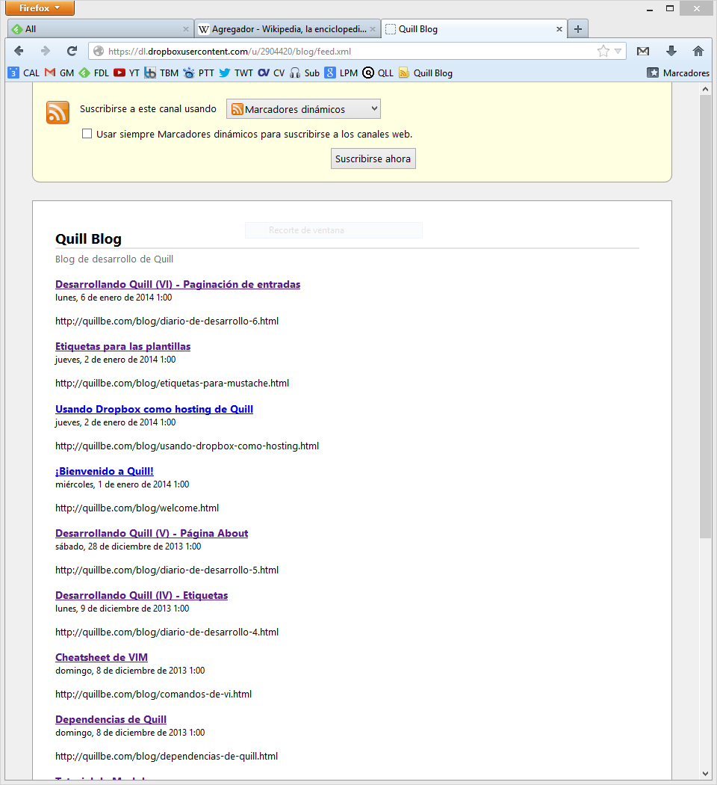
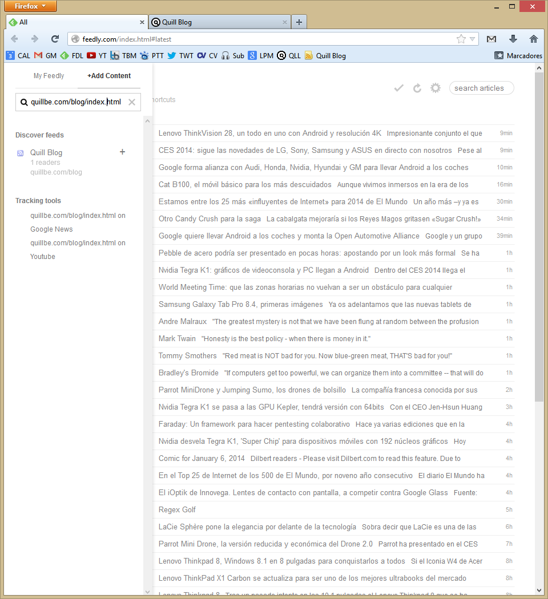

title: Desarrollando Quill (VII) - Feed RSS
author: Manuel Pedrero
date: 2014/1/6 11:42
tags: quill
      diario desarrollo

[RSS](http://es.wikipedia.org/wiki/RSS) (Really Simple Sindication) es un estándar XML  para sindicar o compartir contenido en la web. Resulta muy útil en blogs ya que permite al lector *suscribirse* a nuestro blog usando un [lector de RSS](http://es.wikipedia.org/wiki/Agregador).

Hasta hace relativamente poco, el gestor más utilizado era Google Reader, pero Google decidió cerrarlo, aparentemente por su bajo uso.

Con el cierre de Google Reader han surgido varias alternativas entre las que destaca [Feedly](http://feedly.com), que ya sea mediante su versión web, sus extensiones para Firefox y Chrome o sus apps para *smartphones* permite suscribirse a multitud de blogs, de modo que podamos ver de un vistazo los nuevos artículos, compartirlos, enlazarlos o guardarlos para leerlos más adelante. Para ello, Feedly hace uso del estándar RSS (aunque existen otros compabibles como Atom). Por ello, el disponer de RSS en Quill era una característica casi necesaria.

Actualmente, Quill soporta RSS y regenera el *feed* cada vez que actualizamos el blog. El feed se puede obtener desde la página principal del blog, cambiando el `index.html` por `feed.xml`, pero para que todo sea transparente al usuario se ha enlazado directamente en la página principal, de manera que si nos vamos a un lector RSS y agregamos la página principal de nuestro blog, debería detectar automáticamente el RSS y darnos la opción de suscribirnos.

Una vez suscritos, cada vez que publiquemos nuevas entradas, nuestros lectores serán notificados sin necesidad de que tengan que acceder a nuestro blog para comprobar si hay artículos nuevos.

Con el RSS básico completo, ya están terminadas las características principales que quería incluir en la primera versión pública de Quill, por lo que seguramente en unos días suba a algún repositorio (seguramente GitHub) la versión 0.1.

