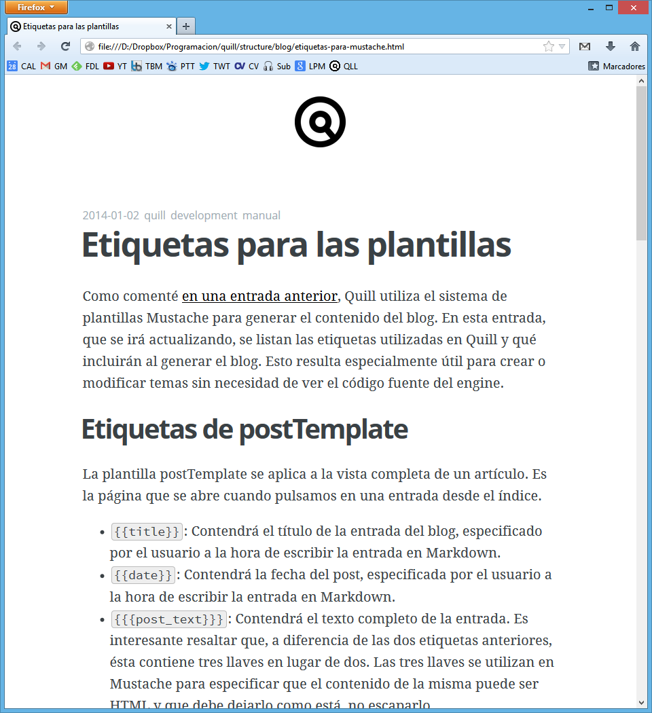

title:   Etiquetas para las plantillas
author:  Manuel Pedrero
date:    2014-01-02
tags:    quill
         development
         documentación
         
Como comenté [en una entrada anterior](diario-de-desarrollo-3.html), Quill utiliza el sistema de plantillas Mustache para generar el contenido del blog. En esta entrada, que se irá actualizando, se listan las etiquetas utilizadas en Quill y qué incluirán al generar el blog. Esto resulta especialmente útil para crear o modificar temas sin necesidad de ver el código fuente del engine.

# Etiquetas de postTemplate
La plantilla postTemplate se aplica a la vista completa de un artículo. Es la página que se abre cuando pulsamos en una entrada desde el índice.

+ `{{title}}`: Contendrá el título de la entrada del blog, especificado por el usuario a la hora de escribir la entrada en Markdown.
+ `{{date}}`: Contendrá la fecha del post, especificada por el usuario a la hora de escribir la entrada en Markdown.
+ `{{{post_text}}}`: Contendrá el texto completo de la entrada. Es interesante resaltar que, a diferencia de las dos etiquetas anteriores, ésta contiene tres llaves en lugar de dos. Las tres llaves se utilizan en Mustache para especificar que el contenido de la misma puede ser HTML y que debe dejarlo como está, no escaparlo.
+ `{{tag_name}}`: Contiene un texto previo antes de listar las etiquetas del post. el texto podría ser `Etiquetas: `, pero puede ser modificado por el usuario en el fichero `quill.cfg`. Lo he hecho de esta forma para que el usuario que esté escribiendo el blog en otro idioma pueda cambiarlo de forma sencilla.
+  `{{{tags}}}`: Contendrá la lista de etiquetas de la entrada (junto con enlaces a las páginas de cada etiqueta).
+  `{{{footer}}}`: Contendrá el pie de página. A día de hoy esta etiqueta no se renderiza, ya que no hay pie de página.

# Etiquetas de tagTemplate
La plantilla tagTemplate se aplica al índice de entradas con una etiqueta determinada. Es la página que se muestra cuando pulsamos en una etiqueta.

+ `{{title}}`: Contiene el nombre del blog, que puede configurarse en `quill.cfg` (BlogName).
+ `{{tag-header}}`: Es un encabezado que aparece en la página justo antes del nombre de la etiqueta, y  configurarse en `quill.cfg` (TagHeader). Al igual que en la etiqueta `tag_name`, se ha hecho así para que cada usuario pueda especificar el encabezado en su propio idioma.
+ `{{tag-name}}`: Su funcionalidad es idéntica a la etiqueta homónima de postTemplate.
+ `{{{entries}}}`: Contendrá la lista de entradas que contengan la etiqueta de la página ordenadas por fecha y comenzando por la más reciente. De momento sólo se muestra la fecha y el título de la entrada.

# Etiquetas de indexTemplate
La plantilla tagTemplate se aplica al índice general de entradas, que es la página principal del blog. Por el momento Quill no pagina el índice de entradas, aunque es una característica que se planea para un futuro.

+ `{{title}}`: Contiene el nombre del blog, que puede configurarse en `quill.cfg` (BlogName).
+ `{{{entries}}}`: Contiene la lista de entradas ordenadas por fecha y comenzando por la más reciente. 
+ `{{{footer}}}`: Como en la etiqueta homónima de postTemplate, de momento no tiene funcionalidad, por lo que no se renderiza.
+ `{{{about}}}`: Contendrá un enlace a la página `About Me` del blog siempre que tenga habilitada dicha característica en `quill.cfg`. Si es así, el texto del enlace será el que el usuario configure en `quill.cfg` (AboutHeader)

El uso de un sistema de plantillas permite por ejemplo crear un tema donde la fecha esté antes del título del post, o las etiquetas se pongan al principio en lugar de al final... las posibilidades son infinitas. Prueba de ello es que he podido crear de forma bastante cómoda un tema alternativo basado en el tema por defecto de [ghost](http://blog.ghost.org/hosted-platform-open/), que me encanta.

La misma entrada con el tema por defecto (se puede ver que necesita un pulido)

Gracias al uso de las etiquetas de Mustache, se pueden crear nuevos temas (o modificar los existentes) de forma muy sencilla. Espero que cuando libere el código, alguien se anime a compartir nuevos temas.