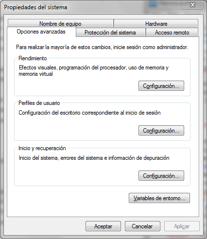
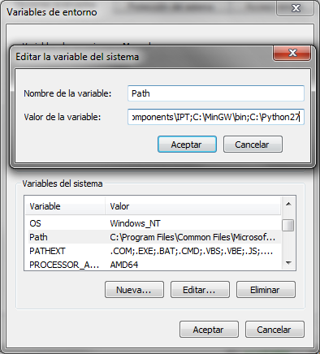
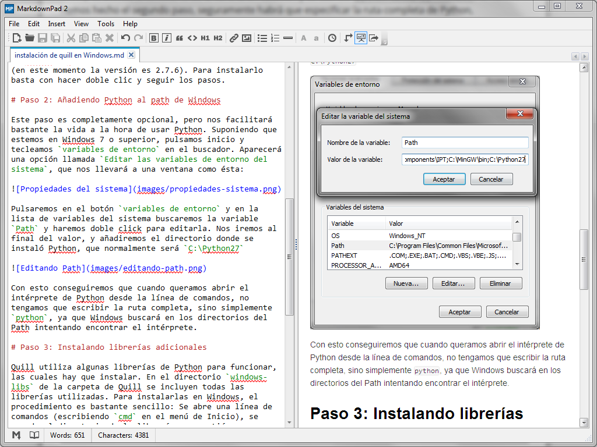
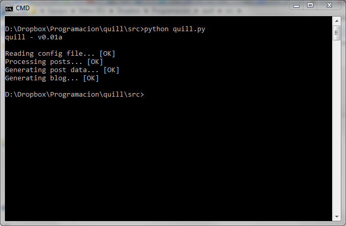

title:   Instalando Quill en Windows
author:  Manuel Pedrero
date:    2013-12-01
tags:    quill
         development

Hasta ahora, todo el desarrollo de Quill se ha realizado bajo Linux, ya que resulta mucho más cómodo a la hora de instalar las bibliotecas necesarias, probar las páginas en un servidor, acceder por ftp directamente desde el sistema de ficheros, etc. 

Sin embargo, la mayoría de personas, entre las que me incluyo, utilizan Windows como sistema principal, por lo que la compatibilidad con Windows de Quill es esencial. Afortunadamente, por el momento Quill está programado únicamente en Python, por lo que la compatibilidad con Windows, Linux y MacOS está prácticamente garantizada.

Si puedes leer esta entrada, quiere decir que la versión de Windows funciona perfectamente. De todas formas, a modo de manual de instrucciones, veremos cómo *instalar* Quill en Windows.

# Paso 1: Instalando Python

Como he comentado, Quill está íntegramente programado en Python (por lo menos por ahora). A diferencia de otros lenguajes como C++, Python es un [lenguaje interpretado](http://es.wikipedia.org/wiki/Python), lo que quiere decir que debemos descargar un intérprete para poder ejecutar nuestro programa. En Linux el intérprete de Python suele venir preinstalado en la mayoría de distribuciones. Para instalarlo en Windows bastará con ir a la [página de descargas de Python](http://www.python.org/download/) y elegir el instalador correspondiente (32bits o 64bits) según nuestra versión de Windows. Quill se ha programado en Python 2.X, por lo que se debe descargar la versión 2 (en este momento la versión es 2.7.6). Para instalarlo basta con hacer doble clic y seguir los pasos.

# Paso 2: Añadiendo Python al path de Windows

Este paso es completamente opcional, pero nos facilitará bastante la vida a la hora de usar Python. Suponiendo que estemos en Windows 7 o superior, pulsamos inicio y tecleamos `variables de entorno` en el buscador. Aparecerá una opción llamada `Editar las variables de entorno del sistema`, que nos llevará a una ventana como ésta:

Pulsaremos en el botón `variables de entorno` y en la lista de variables del sistema buscaremos la variable `Path` y haremos doble click para editarla. Nos iremos al final del valor, y añadiremos el directorio donde se instaló Python, que normalmente será `C:\Python27`

Con esto conseguiremos que cuando queramos abrir el intérprete de Python desde la línea de comandos, no tengamos que escribir la ruta completa, sino simplemente `python`, ya que Windows buscará en los directorios del Path intentando encontrar el intérprete.

# Paso 3: Instalando librerías adicionales

Quill utiliza algunas librerías de Python para funcionar, las cuales hay que instalar. En el directorio `windows-libs` de la carpeta de Quill se incluyen todas las librerías utilizadas. Para instalarlas en Windows, el procedimiento es bastante sencillo: Se abre una línea de comandos (escribiendo `cmd` en el menú de Inicio), se accede al directorio de la librería en cuestión y se escribe `python setup.py install`. Si no hemos hecho el segundo paso, seguramente habrá que especificar la ruta completa de Python, escribiendo, por ejemplo `C:\Python27\python.exe setup.py install`.

Una vez instaladas las librerías adicionales, Quill estará listo para funcionar. Para comprobarlo, bastará con escribir una entrada de prueba (yo estoy utilizando para ésta el editor [MarkdownPad](http://markdownpad.com/) que es gratuito y permite previsualizar el formato a la vez que se escribe:

Una vez terminada la entrada, bastará con hacer click en el programa `quill.py` y debería salir algo parecido a la siguiente imagen:

Si todo ha ido bien, el blog debe estar en el directorio `blog` (aunque recordemos que podemos cambiarlo, por ejemplo a un directorio dentro de la carpeta `public` de Dropbox y tendremos nuestro blog online).

Los siguientes pasos a seguir es pulir la generación del índice del blog con la lista de entradas ordenadas por fecha, y corregir posibles bugs de cara a lanzar la primera versión beta (v0.1). Una vez lanzada, será la hora de añadir etiquetas y más funcionalidad.

# ¿Habrá alguna manera más sencilla de usar Quill?

Las instrucciones de instalación anteriores pueden parecer bastante más tediosas que un simple instalador (de hecho lo son). Esto se debe a que Quill es todavía un *engine* que está a comienzos de su desarrollo. Cuando llegue a una versión estable, seguramente crearé instaladores (o directamente ejecutables) que serán mucho más sencillos de utilizar: los descargarás, escribirás tu primera entrada y harás doble clic en el programa. Sin embargo, por ahora me estoy centrando en que todo funcione como debe, por lo que de momento habrá que seguir los pasos de arriba.