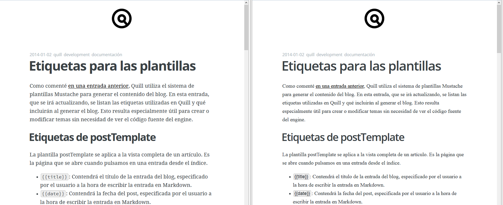
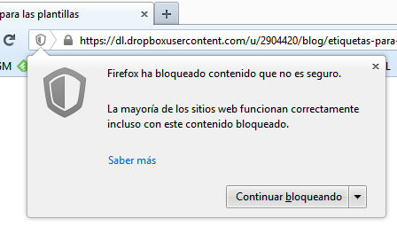
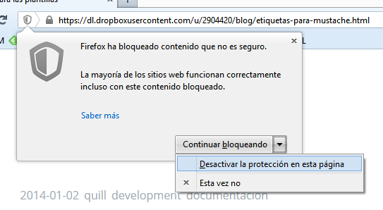

title:   Usando Dropbox como hosting de Quill
author:  Manuel Pedrero
date:    2014-01-02
tags:    quill
         development
         
Una de las ventajas de que Quill sea un engine de blogs estático es que los requerimientos del servidor donde vayamos a alojar el blog se reducen a que pueda servir HTTP. Esto permite alojar el blog en muchísimos sitios, algunos de los cuales seguramente no habías pensado.

Por ejemplo, ahora mismo estás leyendo esta entrada gracias a un espacio de alojamiento que me regala la empresa con la que tengo contratado el dominio. Originalmente está pensado para alojar la típica página de *en construcción* o similar, ya que sus características son:

+ 10MB de espacio web
+ 500MB de transferencia mensual
+ Sin MySQL
+ Sin PHP

En resumen, de sobra para alojar este blog ;)

Otra posibilidad bastante atractiva es alojar el blog en Dropbox, con lo que tienes unos 2GB de espacio web y, en principio, no hay límite de transferencia mensual, por lo que puedes alojar imágenes, archivos, etc. Para ello, basta con especificar en `quill.cfg` la carpeta `public` de Dropbox como destino del blog. Para muestra, [aquí podéis ver esta entrada alojada en mi Dropbox](https://dl.dropboxusercontent.com/u/2904420/blog/etiquetas-para-mustache.html).

Es posible que si el blog está alojado en Dropbox no se vea todo lo bien que debería:

El "problema" es que Dropbox aloja todo su contenido en HTTPS (bendito problema) y, si el navegador (en mi caso Firefox) detecta contenido HTTP dentro de una página HTTPS, se mosquea.

Como explican [aquí](https://support.mozilla.org/es/kb/como-el-contenido-no-seguro-afecta-mi-seguridad?as=u&utm_source=inproduct):

> Cuando visitas una página que utiliza HTTP, tu conexión no está protegida contra escuchas ni ataques intermediario. La mayoría de los sitios web utilizan HTTP porque no conllevan tráfico de información sensible y no necesitan ser seguras. Cuando visitas una página que utiliza HTTPS (candado gris o candado verde en la barra de direcciones), como la de tu banco, la conexión está autenticada y encriptada y, por lo tanto, a salvo de escuchas y ataques intermediario.
> 
> Sin embargo, si la página HTTPS que estás visitando incluye contenido HTTP, la parte HTTP puede ser leída o modificada por los atacantes, incluso aunque la página principal utilice HTTPS. Cuando una página HTTPS tiene contenido HTTP, llamamos a ese contenido "no seguro". La página que estás visitando solo está parcialmente encriptada y aunque parece que es segura, en realidad no lo es. 
> 
> 
> 
> El bloqueo de contenido no seguro bloquea el contenido HTTP potencialmente peligroso de las páginas HTTPS. 

El *contenido no seguro* en cuestión son precisamente las fuentes de los temas, que se cargan desde [Google Fonts](http://www.google.com/fonts), en HTTP.

¿Qué solución tenemos? Básicamente dos:

1. Desactivamos manualmente la detección de contenido no seguro en la página.
2. Cargamos las fuentes desde Dropbox en lugar de hacerlo desde Google Fonts.

Como la primera opción requiere que cada lector desactive la protección por su cuenta, lo más lógico es utilizar la opción 2, que básicamente consiste en poner las fuentes en la carpeta del tema y referenciarlas desde ahí. Quill busca si existe una subcarpeta `fonts` dentro de la carpeta del tema, y en caso de encontrarla la copia al directorio destino del blog, por lo que poniendo ahí las fuentes evitamos este problema con Dropbox. 

De todas formas, es probable que cuando se lance la versión definitiva de Quill los temas vengan ya preparados para poderse usar con Dropbox sin preocuparse de este detalle.